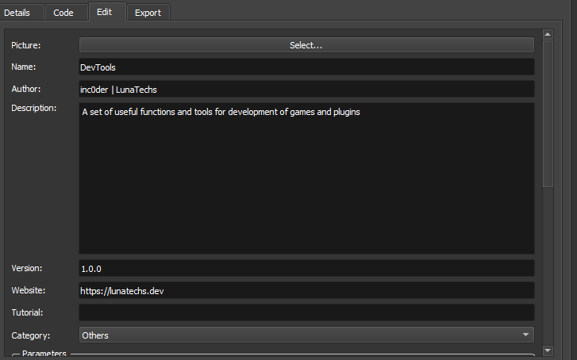

# conventions
Conventions for plugins, help files, readme, blog posts, ... 

## Repo Name

- **For RPG Maker:**
Luna-foo-bar

- **For Paper Maker:**
Origami-foo-bar

**Plugin information note:**
> Note: A key difference with RPG Maker and Paper maker is that Paper Maker contains all plugin command information within its plugin manager. The Paper Maker plugin manager also contains the url, author and other fields all within it, meaning we don't need to edit the fields in a file like in RPG Maker.

 !

## Plugin URL

```@url https://lunatechs.dev/plugins/FooBar```


## Plugin Author

```@author LunaTechs - Pivoo```

## Class Name

```ClassName```


## Function Name

```functionName```


## Global Variable

```globalVariable```


## Local Variable

```_localVariable```


## Comment Category

```
    //========================================================================
    // Main Category
    //========================================================================
```


## Comment Sub-Category

```
    //----------------------------------
    // Sub Category
    //----------------------------------
```

## Plugin commands

```
Identifier commandName args
```

Example: `StorageSystem add 0 $dataItems[1] 10`
